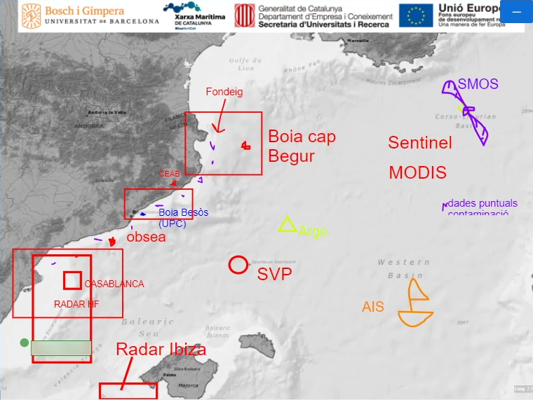

Data: 03/12/20

Lloc: Reunió virtual a través de l'aplicació del CSIC basada en Big Blue Button

# Tema de la reunió
En motiu de l'[acció número 4 (Valoració de les Dades Marítimes)](https://github.com/BlueNetCatAccio4/convocatoria), s'ha fet una pluja d'idees per veure quins possible productes són d'interès per als membres de la Xarxa.

# Participants
Gerard Llorach, Emilio García, Pablo Bou, Xavier García, Montserrat Saperas, Anna Garriga, Anna Sànchez, Ingrid Masaló, Joaquín del Rio, Justino Martínez, Nerea Roher, Rafa Bartolomé, Narcís Pous, Enoc Martínez.

# Resum de la reunió
La reunió s'ha organitzat de la següent forma:
## Introducció (10 min)
S'ha presentat en Gerard Llorach com a representant de la Xarxa i encarregat de l'acció número 4. Seguidament, s'ha explicat l'estructura de la reunió i quins objectius té.

## Pluja d'idees en grups (15 min)
S'han separat els participants en grups de tres en sales virtuals. Els participants han recollit possibles productes i dinamitzacions que es poden fer amb les dades recollides pels diferents grups de recerca de la Xarxa.

## Mapa interactiu i recollida d'idees (15 min)
Els participants han compartit en el xat de la reunió les idees recollides. Mentrestant, s'ha habilitat una pissarra multiusuari amb un mapa de la conca catalana, on els participants han escrit totes les dades marítimes que es recullen.

## Propers passos (7 min)
En aquesta última fase s'ha explicat com es procedirà en l'acció número 4. Es farà un formulari per als grups de la Xarxa perquè envïin propostes de productes per valoritzar les dades. D'aquestes propostes rebudes, es farà una selecció segons els barems indicats (open data, TRL, SRL, impacte a la societat i a la Xarxa, etc).

# Conclusions
S'ha pogut realitzar amb èxit una pluja d'idees telemàtica. S'han pogut recollir diverses idees que es podrien convertir en productes d'èxit. Els diferents participants han pogut veure i entendre algunes necessitats d'altres membres i quin tipus de dades consumeixen/produeixen. Creiem que sessions com aquestes són beneficials per a la Xarxa, ja que els investigadors es poden conèixer entre si, aprendre sobre altres sectors de la BlueNetCat i guanyar coneixements per fer millor recerca.
Donat que a la Xarxa hi ha molts membres i que tots estaven convidats, la participació ha estat baixa. Creiem que pot ser un problema de comunicació, ja que el vídeo que es va fer per convocar la reunió només va arribar a 32 persones (https://youtu.be/29pRhXRMa_Q).

# Documents resultants
## Idees recollides
- Geoportal: mostrar on hi ha dades, i quin tipus de dades. Mars, estuarius, rius… Amb enllaços/punters a on trobar les dades.
- Base de dades, recollint i replicant altres dades.
- Crear un grup de BlueNetCat a EMODNET i ajudar des de la Xarxa a fer arribar les dades.
- Una app on poder georeferencia dades de ciutadans i on poder introduir resultats per connectar amb la societat i grups d'interès.
- App de recollida de dades i visualització de dades recollides (sigui per científics o sigui per ciutadans) en temps real que siguin d'interès per la societat o sectors econòmics.
- Mapa de contaminació de plàstics.
- Mapa d'instal·lacions d'Aqüicultura.
- Mapa de soroll submarí (mesurat in situ) + dades de navegació (AIS) + models de predicció de soroll.
- Mapa d'explotacions d'aqüìcultura superposat a mapes de contaminació de les aigües.
- Regulatòria sobre micro-nanoplàstics: Marge de referència de concentracions de plàstics permeses.
- Mapejat canals de descàrrega d'aigües continentals a la costa.
- Dades de navegació de vaixells accesibles no només a companyies si no també a la societat.
- Sistema de predicció de corrents, temperatura per científics i societat.
- Mapes de distribució d'espècies invasores.
- Millorar models per determinar d'on venen els plàstics.
- Dades de la qualitat (metall pesats) de les macroalgues al llarg del litoral.

## Pissarra multiusuari

